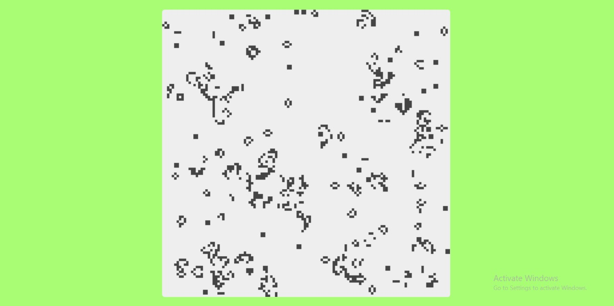

# GameOfLIfe_Js

Conway's Game of Life made in Js

## Some Historical Information:

The Game of Life, also known simply as Life, is a cellular automaton devised by the British mathematician John Horton Conway in 1970. It is a zero-player game, meaning that its evolution is determined by its initial state, requiring no further input. One interacts with the Game of Life by creating an initial random configuration and observing how it evolves.

## Sample:

This is an image of the final deployment.

There is a link in the description section but i done a QR for you!

